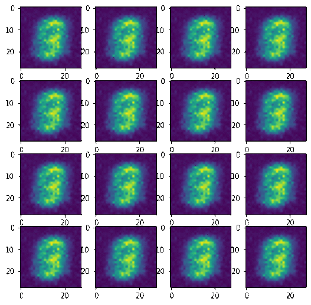
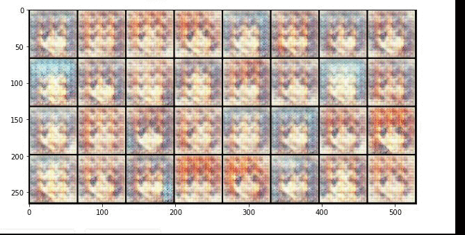

# Portfolio
---
## Generative Adversarial Networks (GANs)

---
### Generating images using GANs: applying to MNIST dataset

  

My complete implementation project about generative adversarial networks.

 A system that learns how to generate new image data with the same statistics as the training set. First, I used the MNIST dataset training base, a database of handwritten digits commonly used to train various image processing systems. I used the same technique to generate images in other contexts, such as faces. 

---
### Generating face animes using Neural Network  
  

An implementation project about generative adversarial networks applied in generating anime faces. 

 A system that learns how to generate new image data with the same statistics as the training set. In context, I used the anime face dataset to generate random faces using a GAN (Generative Adversarial Networks). The database used for this project can be found on Kaggle. 

**Anime Face Dataset**: https://www.kaggle.com/splcher/animefacedataset

